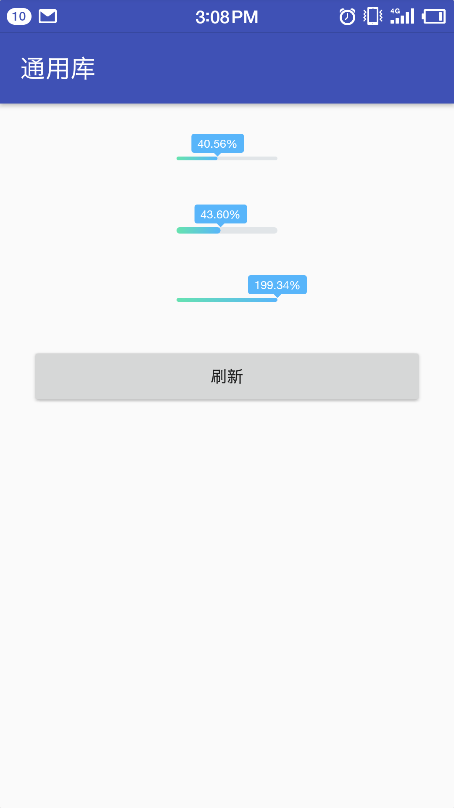

# WidgetCase

<!--https://shields.io/-->
<!--[![auc][aucsvg]][auc] [![api][apisvg]][api] [![License][licensesvg]][license]-->

[](https://github.com/faith-hb/WidgetCase/) [](https://github.com/faith-hb/WidgetCase) 


#### 项目介绍
跟着公司项目走了一年之久的自定义控件Library，稳定性和兼容性已有所保障。由于公司项目偏向于统计类，所以项目里更多的是这方面的控件；但既然把库都抽出来了，就绝不可能只是涉及到统计类这块，会发散到更多的应用场景中去。因此，此库会一直维护下去，直至Android倒下，本人倒下(决心表的很大)。当然一个人的力量总是有限的，在这期待更多志同道合的码友们的加入，大家在一起干点轰轰烈烈的事情。


#### 效果刷一波，毕竟是看脸吃饭的年代
<!--{:height="960px" width="540px"}-->

<!---->

##### 功能目录>>>


##### 峰值图>>>[TaperChart & TaperChartLayout]


##### 渐变曲线>>>[GradientLine]


##### 圆环进度>>>[RingView & LegendRingView]
      

##### 圆环进度带底部角标>>>[CircleProgressBarView]  带刻度的圆环>>>[GradientProBar]  横向进度-带进度提示>>>[HorProBar]
      

#### 自定义控件分布如下

##### 峰值图
1. [TaperChart](TaperChart.java)
2. [TaperChartLayout](TaperChartLayout.java)
3. [HorTaperChart(还有问题)](HorTaperChart.java)

##### 圆形进度条
1. [CircleProgress](CircleProgress.java)
2. [GradientProBar](GradientProBar.java)
3. [CircleProgressBarView](CircleProgressBarView.java)
4. [CircleView](CircleView.java)

##### 环形进度条
1. [RingView](RingView.java)
2. [LegendRingView(内含图例)](LegendRingView.java)

##### 半圆/油表
1. [HalfCircleProView](HalfCircleProView.java)

##### 横向进度条
1. [HorProBar](HorProBar.java)
2. [SectionProBar](SectionProBar.java)
3. [ShadowProBar](ShadowProBar.java)
4. [LoadingLineView](LoadingLineView.java)

##### 渐变曲线
[GradientLine](GradientLine.java)


##### 系统控件重写
1. [FixGridView](FixGridView.java)
2. [FixListView](FixListView.java)
3. [NoScrollViewPager](NoScrollViewPager.java)

##### 贝塞尔曲线练练手
[PathMorphBezier](PathMorphBezier.java)


#### Download

Step 1.

``` groovy
allprojects {
    repositories {
        ...
        maven {
            url 'http://47.93.38.184:8081/nexus/content/repositories/faithhb/'
        }
    }
}
```

Step 2.

Gradle:
``` groovy
implementation 'com.faithhb:widgetcase:1.7.8'
```

widgetcase最新版本：[](http://47.93.38.184:8081/nexus/service/local/repositories/faithhb/content/com/faithhb/widgetcase/1.7.8/widgetcase-1.7.8.pom)

or

aar:
``` groovy
implementation(name: 'hawkeye_widget-release', ext: 'aar')
```

#### Proguard
``` groovy
-dontwarn com.dongni.**
-keep class com.dongni.** { *; }

# 页面modle避免混淆
-keep class com.doyou.cv.bean.**{*; }
-keep class com.doyou.cv.WLogger{*; }

-keep class com.doyou.cv.widget.**
-keepclassmembers class com.doyou.cv.widget.** {
    public *;
}
```

#### 有问题怎么办？
首先有问题的话，可以提issue，我会经常去看的，能解决的肯定会及时解决，不能解决的会想办法解决的。

#### 想加入一起来维护这个开源项目，该怎么操作？
你可以先fork下来这个项目然后自己去修改一些网友的问题或者自己发现的问题和需要优化的地方，再通过发pr的形式给我，我会第一时间查看代码并进行测试及合并代码。
这样坚持提交超过3个pr的小伙伴（并且质量不错哦），我会直接邀请他称为该项目的开发者，真正做到方便，快速的维护这个开源库。。。

#### 联系方式：
微信：faith-hb<br>
QQ：907167515

#### License

   Copyright 2019 faith-hb

    Licensed under the Apache License, Version 2.0 (the "License");
    you may not use this file except in compliance with the License.
    You may obtain a copy of the License at

        http://www.apache.org/licenses/LICENSE-2.0

    Unless required by applicable law or agreed to in writing, software
    distributed under the License is distributed on an "AS IS" BASIS,
    WITHOUT WARRANTIES OR CONDITIONS OF ANY KIND, either express or implied.
    See the License for the specific language governing permissions and
    limitations under the License.